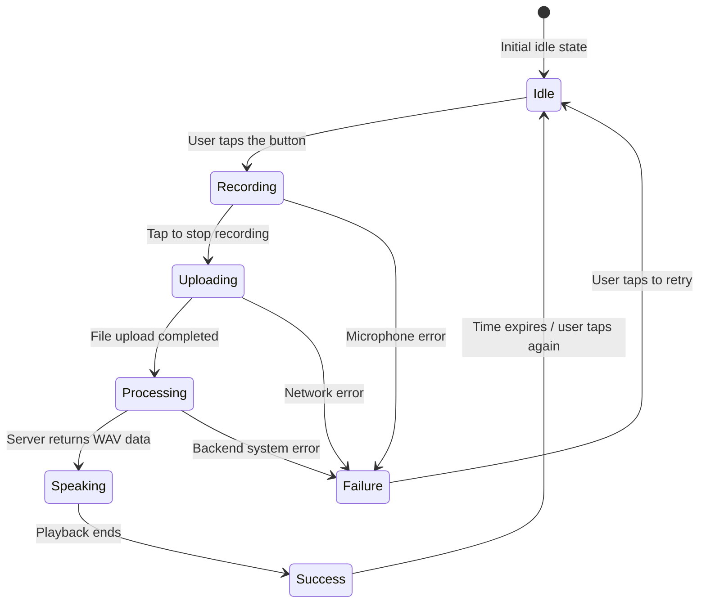

## 3.3. UI/UX design (User Interface & User Experience)

### 3.3.1. Minimalist voice-first design philosophy
The **VocalMind** user interface is built on the **"Less is More"** and **"Voice-First"** philosophies. The user experience is designed to eliminate complex settings and stacked categories commonly found in traditional note-taking apps. The core goal is to place the user into interaction mode immediately when the app opens.

The app's main screen (`VoiceScreen`) focuses on just three visible interaction elements:
1.  **Voice language dropdown:** Neatly placed in the upper-left corner in the form of a soft rounded InputDecorator box. It lets the user switch the recording language instantly.
2.  **Response text view:** Centered on the screen, it displays the AI assistant's answer in a large, easy-to-read font.
3.  **Pulse Mic Button:** The largest visual focal point at the bottom of the screen, acting as a clear multi-state trigger button.

---

### 3.3.2. Material Design 3 and dynamic design tokens
The design system follows Google's latest **Material Design 3** guidelines, producing a modern, refined, and consistent look.

#### 3.3.2.1. Color palette
VocalMind's palette uses modern HSL tones that are gentle on the eyes and high-contrast, with automatic Light Mode and Dark Mode support:
*   **Primary color:** Deep Indigo blue (`theme.colorScheme.primary`) conveys trust and the intelligence of AI.
*   **Error color:** Warm coral red (`theme.colorScheme.error`) is used as the indicator for recording state and microphone errors.
*   **Surface color:** Soft neutral gray (`theme.colorScheme.surface`) combined with container backgrounds (`surfaceContainerHighest`) to create visual depth.

#### 3.3.2.2. Typography
The app uses the modern **Outfit** / **Inter** font family together with the mobile system default typography.
*   Response titles use `headlineMedium` with carefully tuned line height (`height: 1.35`) so users can read quickly without eye strain.
*   Status text uses `bodyLarge` or `bodyMedium` in a soft gray (`onSurfaceVariant`) so attention stays on the main response content.

---

### 3.3.3. Animated Pulse Mic Button design
The central record button (`_PulseMicButton`) is the heart of the VocalMind interface. It is designed as a large 150dp circular button with smooth micro-animations that correspond to the system state machine:

The states are represented visually in the interface:
1.  **Idle:** The button shows the primary Indigo blue. Inside is the microphone icon (`Icons.mic`). No animation is used to save device battery.
2.  **Recording:** The button immediately changes to bright Coral red, and the mic icon becomes a stop square (`Icons.stop`). A continuous pulse animation is also activated:
    *   The button circle gently scales between 1.0 and 1.1 using `AnimationController` with a 1400ms cycle.
    *   A glow shadow expands around the button with opacity varying from 0.18 to 0.30. This creates the feeling that the button is "breathing" and actively listening to the user's speech.
3.  **Uploading / Processing:** When the user stops recording, the button turns light gray and becomes non-interactive. The icon changes to a spinning hourglass (`Icons.hourglass_top`) or a waiting icon, showing that the system is uploading data and waiting for AI output.
4.  **Speaking:** The button shows an audio wave icon or is lightly locked so the user can listen to the assistant.
5.  **Failure:** The button switches to a warning icon, and the status text shows the error cause in detail, such as network failure or microphone permission denial, in a strong red color for easy recognition and recovery.
