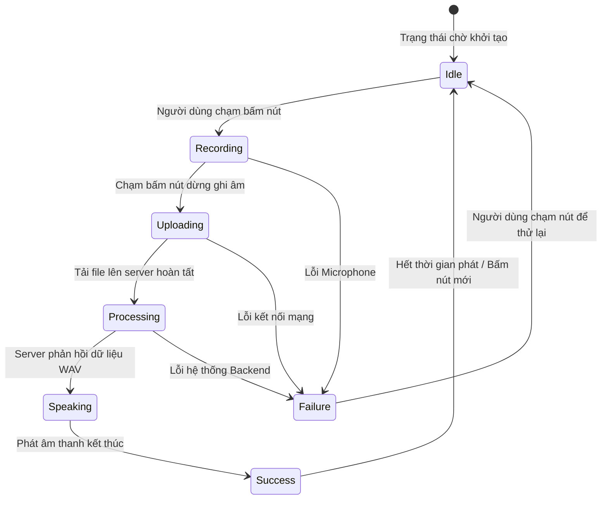

## 3.3. Thiết kế giao diện UI/UX (User Interface & User Experience)

### 3.3.1. Triết lý thiết kế Voice-First tối giản (Minimalist Voice-First UI/UX)
Giao diện người dùng của **VocalMind** được xây dựng dựa trên triết lý **"Less is More"** (Càng ít thao tác càng tốt) và **"Voice-First"** (Giọng nói là chủ đạo). Trải nghiệm người dùng được thiết kế để loại bỏ hoàn toàn các cấu hình phức tạp hay các danh mục xếp chồng thường thấy trong các ứng dụng ghi chú truyền thống. Mục tiêu cốt lõi là đưa người dùng vào trạng thái tương tác ngay lập tức khi ứng dụng được mở ra.

Màn hình chính của ứng dụng (`VoiceScreen`) chỉ tập trung vào ba thành phần giao tiếp trực quan:
1.  **Bộ chọn ngôn ngữ hội thoại (Voice Language Dropdown):** Nằm gọn gàng ở góc trên bên trái màn hình dưới dạng hộp InputDecorator bo tròn mềm mại. Cho phép người dùng chuyển đổi ngôn ngữ thu âm tức thì.
2.  **Khu vực hiển thị văn bản hồi đáp (Response Text View):** Nằm ở trung tâm màn hình, hiển thị văn bản câu trả lời của trợ lý AI bằng kích cỡ chữ lớn, dễ đọc.
3.  **Nút ghi âm xung mạch (Pulse Mic Button):** Đóng vai trò là điểm nhấn giao diện lớn nhất ở phần dưới màn hình, hoạt động như một nút kích hoạt đa trạng thái trực quan.

---

### 3.3.2. Hệ thống thiết kế Material Design 3 và Bảng màu sắc động (Dynamic Design Tokens)
Hệ thống thiết kế áp dụng các hướng dẫn thiết kế mới nhất của Google - **Material Design 3**, mang lại vẻ đẹp hiện đại, tinh tế và đồng bộ. 

#### 3.3.2.1. Bảng màu sắc (Color Palette)
Bảng màu của VocalMind sử dụng các tông màu HSL hiện đại, dịu mắt và độ tương phản cao, hỗ trợ cả chế độ Sáng (Light Mode) và Tối (Dark Mode) tự động:
*   **Primary Color (Màu chủ đạo):** Xanh dương Indigo sâu (`theme.colorScheme.primary`) thể hiện sự tin cậy, thông thái của một trí tuệ nhân tạo.
*   **Error Color (Màu ghi âm/Lỗi):** Đỏ san hô ấm (`theme.colorScheme.error`) dùng làm màu chỉ thị trạng thái đang ghi âm (Recording) và trạng thái lỗi microphone.
*   **Surface Color (Màu bề mặt):** Tông màu xám trung tính mềm mại (`theme.colorScheme.surface`) kết hợp màu nền của các hộp chứa (`surfaceContainerHighest`) để tạo chiều sâu giao diện (visual elevation).

#### 3.3.2.2. Kiểu chữ (Typography)
Ứng dụng sử dụng bộ font chữ hiện đại **Outfit** / **Inter** kết hợp với kiểu chữ mặc định của hệ thống di động.
*   Tiêu đề phản hồi hiển thị kiểu `headlineMedium` với chiều cao dòng (`height: 1.35`) được tính toán kỹ lưỡng giúp người dùng đọc nhanh mà không bị mỏi mắt.
*   Văn bản trạng thái hiển thị kiểu `bodyLarge` hoặc `bodyMedium` với màu xám dịu (`onSurfaceVariant`) để không làm phân tán sự tập trung khỏi nội dung phản hồi chính.

---

### 3.3.3. Thiết kế nút Micrô xung mạch động (Pulse Mic Button State Machine)
Nút ghi âm trung tâm (`_PulseMicButton`) là linh hồn của giao diện VocalMind. Nút được thiết kế dưới dạng một nút tròn lớn đường kính 150dp có tích hợp hiệu ứng chuyển động mượt mà (Micro-animations) tương ứng với máy trạng thái (State Machine) của hệ thống:

Các trạng thái được biểu diễn trực quan trên giao diện:
1.  **Trạng thái Chờ (Idle):** Nút hiển thị màu xanh Indigo chủ đạo. Bên trong là biểu tượng micrô (`Icons.mic`). Không có hiệu ứng chuyển động để tiết kiệm pin thiết bị.
2.  **Trạng thái Đang ghi âm (Recording):** Nút lập tức chuyển sang màu đỏ Coral rực rỡ, biểu tượng mic chuyển thành hình vuông dừng (`Icons.stop`). Đồng thời, một hiệu ứng xung mạch (Pulse Animation) được kích hoạt liên tục:
    *   Vòng tròn nút co giãn nhẹ nhàng từ tỷ lệ 1.0 đến 1.1 bằng `AnimationController` với chu kỳ 1400ms.
    *   Tạo ra một quầng sáng mờ (Glow Shadow) lan tỏa xung quanh nút với độ mờ biến thiên từ 0.18 đến 0.30. Hiệu ứng này tạo cảm giác nút như đang "thở" và chủ động lắng nghe giọng nói của người dùng.
3.  **Trạng thái Đang xử lý (Uploading / Processing):** Khi người dùng nhấn nút dừng, nút chuyển sang màu xám nhạt khóa tương tác, biểu tượng đổi thành đồng hồ cát (`Icons.hourglass_top`) xoay nhẹ hoặc biểu tượng chờ, thể hiện hệ thống đang tải dữ liệu và chờ AI phản hồi.
4.  **Trạng thái Phát âm thanh (Speaking):** Nút hiển thị biểu tượng sóng âm thanh hoặc khóa tương tác nhẹ để người dùng lắng nghe trợ lý nói.
5.  **Trạng thái Lỗi (Failure):** Nút chuyển sang biểu tượng cảnh báo và văn bản trạng thái hiển thị chi tiết nguyên nhân lỗi (như lỗi kết nối mạng, quyền mic bị từ chối) bằng màu đỏ đặc trưng để người dùng dễ dàng nhận biết và khắc phục.
