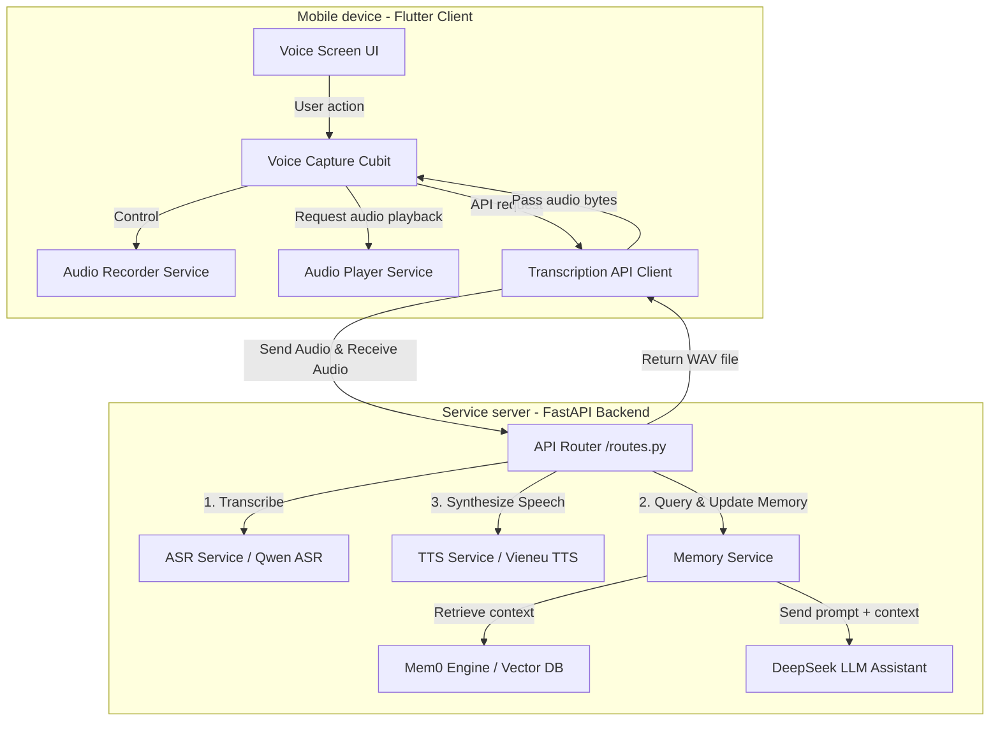

# CHAPTER 3. PRODUCT DESIGN AND DEVELOPMENT

## 3.1. Overall system architecture

### 3.1.1. Service-oriented Client-Server model
The **VocalMind** system is designed with a modern Client-Server model that clearly separates responsibilities between the user-facing mobile app (Client) and the AI processing server (Server). This separation keeps the mobile app lightweight and smooth on mid-range devices, while heavy tasks such as speech recognition (ASR), natural language processing (LLM), memory retrieval, and speech synthesis (TTS) are handled by a GPU-enabled server.

The overall system architecture is shown below:



### 3.1.2. System data flow sequence
When a user interacts with the assistant by voice, the end-to-end data flow proceeds through the following steps:

1.  **Client-side recording:** The user taps the microphone button on the mobile device to start speaking. The recording app uses `AudioRecorderService` to capture microphone input and save it as `.m4a` or `.wav` audio.
2.  **Audio upload:** When the user stops recording, the app sends a `POST` request with `multipart/form-data` to the backend endpoint `/v1/voice/assistant`. The audio file is transmitted as binary data along with the configured language code (for example, `vi` or `en`).
3.  **Speech recognition (ASR) on the backend:** The FastAPI backend receives the audio file, uses `PyAV` to decode the raw audio stream into a NumPy array, normalizes the sample rate, and passes it to `Qwen3ASRModel` to generate raw transcription text.
4.  **Memory processing and response generation (Memory & LLM):** The transcription text is sent to `MemoryService`.
    *   The system calls `memory.search()` from `Mem0` to find the 5 most semantically similar memories related to what the user just said.
    *   The retrieved memories are combined with the user's current utterance to form a complete contextual prompt for the DeepSeek large language model (`deepseek-v4-flash`).
    *   DeepSeek generates a short, natural response in text form.
    *   The system calls `memory.add()` to add the new User-Assistant conversation pair to the user's memory graph.
5.  **Speech synthesis (TTS) on the backend:** The LLM response text is sent to `TtsService`. The `Vieneu` model synthesizes it into natural Vietnamese WAV audio using the configured voice preset.
6.  **Return and playback on the client:** The server returns binary WAV audio in the HTTP response with media type `audio/wav`. The Client receives the audio bytes, passes them to `AudioPlayer` for immediate playback, and also displays the response text on screen.

---

### 3.1.3. Detailed API endpoint design

The system provides four main RESTful endpoints for operation:

#### 3.1.3.1. Standalone speech recognition endpoint (`/asr`)
*   **Method:** `POST`
*   **Content-Type:** `multipart/form-data`
*   **Input parameters:**
    *   `file` (binary file): Audio recording file.
    *   `language` (String, Optional): Recognition language (`vi` or `en`).
*   **Response (JSON):**
    ```json
    {
        "text": "recognized text",
      "language": "vietnamese",
      "model": "qwen-asr-model-name",
      "filename": "audio.m4a",
      "content_type": "audio/x-m4a"
    }
    ```

#### 3.1.3.2. Standalone speech synthesis endpoint (`/tts`)
*   **Method:** `POST`
*   **Content-Type:** `application/json`
*   **Input parameters (JSON):**
    ```json
    {
      "text": "Text to synthesize into speech",
      "voice": "vietnamese-female-preset"
    }
    ```
*   **Response:** Stream binary audio data as `audio/wav`.

#### 3.1.3.3. Integrated voice assistant endpoint (`/v1/voice/assistant`)
This is the core endpoint connecting all three AI services (ASR -> Memory/LLM -> TTS) to optimize network efficiency.
*   **Method:** `POST`
*   **Content-Type:** `multipart/form-data`
*   **Input parameters:**
    *   `file` (binary file): The user's voice audio file.
    *   `language` (String, Optional): Conversation language.
*   **Response:** Stream binary response audio as `audio/wav`, with `Content-Disposition: attachment; filename="assistant.wav"`.

#### 3.1.3.4. System health check endpoint (`/health`)
*   **Method:** `GET`
*   **Response (JSON):** `{"status": "ok"}`
