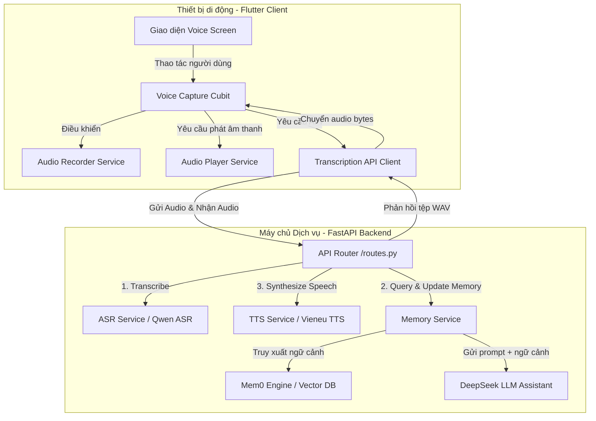

# CHƯƠNG 3. THIẾT KẾ VÀ PHÁT TRIỂN SẢN PHẨM

## 3.1. Kiến trúc hệ thống tổng thể

### 3.1.1. Mô hình Client-Server hướng dịch vụ
Hệ thống **VocalMind** được thiết kế theo mô hình Client-Server hiện đại, phân tách rõ ràng nhiệm vụ giữa ứng dụng di động phía người dùng (Client) và hệ thống máy chủ xử lý trí tuệ nhân tạo (Server). Sự phân tách này đảm bảo ứng dụng di động chạy nhẹ nhàng, mượt mà trên nhiều thiết bị di động cấu hình trung bình, trong khi các tác vụ nặng về tính toán như nhận dạng âm thanh (ASR), xử lý ngôn ngữ tự nhiên (LLM), truy xuất bộ nhớ và tổng hợp giọng nói (TTS) được đảm nhận bởi máy chủ có hỗ trợ GPU chuyên dụng.

Dưới đây là sơ đồ kiến trúc hệ thống tổng thể biểu diễn mối quan hệ giữa các thành phần:



### 3.1.2. Luồng dữ liệu hoạt động của hệ thống (Dataflow Sequence)
Khi người dùng thực hiện tương tác giọng nói với trợ lý, luồng dữ liệu end-to-end được triển khai qua các bước tuần tự sau:

1.  **Ghi âm phía Client:** Người dùng nhấn nút micrô trên thiết bị di động để bắt đầu nói. Ứng dụng ghi âm sử dụng `AudioRecorderService` để thu tín hiệu từ microphone và lưu thành tệp âm thanh định dạng `.m4a` hoặc `.wav`.
2.  **Gửi dữ liệu âm thanh:** Khi người dùng nhấn dừng, ứng dụng gửi một yêu cầu `POST` dạng `multipart/form-data` tới endpoint `/v1/voice/assistant` của backend. Tệp tin âm thanh được truyền tải dưới dạng nhị phân kèm theo mã ngôn ngữ cấu hình mong muốn (ví dụ: `vi` hoặc `en`).
3.  **Nhận dạng giọng nói (ASR) tại Backend:** FastAPI Backend nhận được tệp âm thanh, sử dụng thư viện `PyAV` để giải mã luồng âm thanh thô thành mảng NumPy, chuẩn hóa tần số lấy mẫu và chuyển cho mô hình `Qwen3ASRModel` thực hiện nhận dạng sang văn bản thô (transcription text).
4.  **Xử lý Trí nhớ và Sinh câu trả lời (Memory & LLM):** Văn bản nhận dạng được gửi tới `MemoryService`.
    *   Hệ thống gọi phương thức `memory.search()` của thư viện `Mem0` để tìm kiếm 5 ký ức có độ tương đồng ngữ nghĩa cao nhất liên quan đến nội dung người dùng vừa nói.
    *   Nội dung ký ức tìm được kết hợp với câu nói hiện tại của người dùng để làm thành một prompt ngữ cảnh đầy đủ gửi tới mô hình ngôn ngữ lớn DeepSeek (`deepseek-v4-flash`).
    *   DeepSeek sinh câu trả lời ngắn gọn, tự nhiên dưới dạng văn bản.
    *   Hệ thống gọi phương thức `memory.add()` để cập nhật cặp hội thoại (User - Assistant) mới vào đồ thị ký ức của người dùng.
5.  **Tổng hợp giọng nói (TTS) tại Backend:** Văn bản phản hồi của LLM được chuyển tới `TtsService`. Mô hình `Vieneu` thực hiện tổng hợp văn bản này thành luồng âm thanh WAV tiếng Việt tự nhiên theo giọng đọc cấu hình sẵn.
6.  **Trả về và Phát âm thanh phía Client:** Máy chủ trả về dữ liệu âm thanh nhị phân WAV trong phản hồi HTTP Response với định dạng `audio/wav`. Phía Client nhận được mảng bytes âm thanh, chuyển vào `AudioPlayer` để phát ngay lập tức cho người dùng nghe, đồng thời hiển thị văn bản phản hồi lên màn hình.

---

### 3.1.3. Thiết kế các API Endpoints chi tiết

Hệ thống cung cấp 4 endpoints RESTful chính phục vụ cho việc vận hành:

#### 3.1.3.1. Endpoint Nhận dạng Giọng nói độc lập (`/asr`)
*   **Method:** `POST`
*   **Content-Type:** `multipart/form-data`
*   **Tham số đầu vào:**
    *   `file` (File nhị phân): Tệp tin âm thanh ghi âm.
    *   `language` (String, Optional): Ngôn ngữ nhận dạng (`vi` hoặc `en`).
*   **Phản hồi (JSON):**
    ```json
    {
      "text": "văn bản nhận dạng được",
      "language": "vietnamese",
      "model": "qwen-asr-model-name",
      "filename": "audio.m4a",
      "content_type": "audio/x-m4a"
    }
    ```

#### 3.1.3.2. Endpoint Tổng hợp Giọng nói độc lập (`/tts`)
*   **Method:** `POST`
*   **Content-Type:** `application/json`
*   **Tham số đầu vào (JSON):**
    ```json
    {
      "text": "Văn bản cần tổng hợp thành giọng nói",
      "voice": "vietnamese-female-preset"
    }
    ```
*   **Phản hồi:** Stream dữ liệu nhị phân tệp tin âm thanh dạng `audio/wav`.

#### 3.1.3.3. Endpoint Trợ lý Giọng nói tích hợp (`/v1/voice/assistant`)
Đây là endpoint cốt lõi kết nối cả 3 dịch vụ AI (ASR -> Memory/LLM -> TTS) để tối ưu hóa hiệu năng truyền tải mạng.
*   **Method:** `POST`
*   **Content-Type:** `multipart/form-data`
*   **Tham số đầu vào:**
    *   `file` (File nhị phân): Tệp tin âm thanh giọng nói của người dùng.
    *   `language` (String, Optional): Ngôn ngữ của cuộc trò chuyện.
*   **Phản hồi:** Stream dữ liệu nhị phân tệp tin âm thanh phản hồi dạng `audio/wav`, kèm tiêu đề HTTP Header `Content-Disposition: attachment; filename="assistant.wav"`.

#### 3.1.3.4. Endpoint Kiểm tra sức khỏe hệ thống (`/health`)
*   **Method:** `GET`
*   **Phản hồi (JSON):** `{"status": "ok"}`
