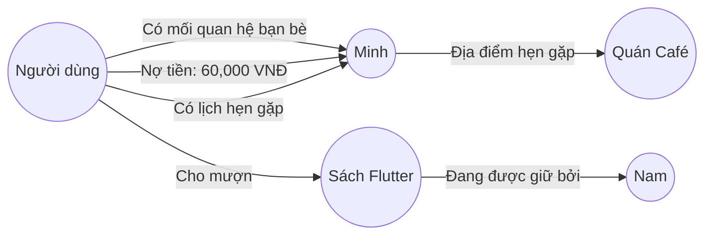

## 3.2. Thiết kế Cơ sở dữ liệu và Cơ chế lưu trữ Memory

### 3.2.1. Cấu trúc lưu trữ dữ liệu của hệ thống Mem0
Hệ thống **VocalMind** sử dụng một cơ chế lưu trữ dữ liệu phi truyền thống. Thay vì thiết kế cơ sở dữ liệu quan hệ (RDBMS) phức tạp với hàng chục bảng liên kết qua khóa ngoại (foreign keys), hệ thống tận dụng sức mạnh của **Cơ sở dữ liệu Vector (Vector Database)** kết hợp **Đồ thị Tri thức (Knowledge Graph)** được quản lý thông qua thư viện Mem0.

Cấu trúc lưu trữ bộ nhớ của mỗi người dùng trong Mem0 bao gồm hai thành phần lưu trữ song song:

#### 3.2.1.1. Bộ lưu trữ Vector (Vector Store)
Mỗi ký ức của người dùng được phân rã thành các khẳng định tri thức ngắn gọn (ví dụ: *"Người dùng tên là Nam"*, *"Nam có một con mèo tên là Mun"*, *"Nam nợ Minh 60.000 VNĐ vào ngày 15/06/2026"*). Mỗi khẳng định này được chuyển đổi thành một vector biểu diễn ngữ nghĩa (embedding vector) bằng mô hình embedding và lưu trữ trong Vector Database đi kèm các metadata như:
*   `id`: Mã định danh duy nhất của ký ức (UUID).
*   `user_id`: Mã định danh của người dùng sở hữu ký ức (ví dụ: `default-user`).
*   `text`: Văn bản gốc của ký ức dạng thô.
*   `created_at`: Thời gian ghi nhận ký ức.
*   `updated_at`: Thời gian cập nhật ký ức gần nhất.

#### 3.2.1.2. Bộ lưu trữ đồ thị tri thức (Graph Store)
Song song với Vector Store, Mem0 xây dựng một đồ thị dạng mạng lưới các thực thể và mối quan hệ (Nodes and Edges).
*   **Nodes (Thực thể):** Đại diện cho Con người (User, Minh, Nam), Địa điểm (Văn phòng, Quán Café), Vật thể (Cuốn sách Flutter, Tiền), Sự kiện (Lịch hẹn, Khoản nợ).
*   **Edges (Mối quan hệ):** Đại diện cho sự liên kết giữa các thực thể, đi kèm nhãn thuộc tính (Ví dụ: `USER --[NỢ_TIỀN (số_tiền: 60k)]--> MINH`).

Dưới đây là một sơ đồ minh họa cấu trúc Đồ thị Trí nhớ cá nhân trong hệ thống VocalMind:

---

### 3.2.2. Cơ chế tự động phân loại, trích xuất và liên kết ký ức

Quy trình quản lý ký ức diễn ra hoàn toàn tự động và ẩn dưới nền thông qua hai phương thức chính: **Truy hồi ngữ nghĩa (Search)** và **Ghi nhớ liên tục (Add/Update)**.

#### 3.2.2.1. Quy trình Truy hồi ngữ nghĩa (Retrieval)
Khi người dùng nói: *"Hôm trước tao hẹn gặp Minh ở đâu ấy nhỉ?"*, hệ thống thực hiện tìm kiếm ngữ nghĩa trên Vector Store:
1.  Truy vấn được chuyển thành vector truy vấn (query vector).
2.  Thực hiện tìm kiếm khoảng cách Cosine trên cơ sở dữ liệu vector để tìm ra 5 vector ký ức gần nhất liên quan tới các thực thể "hẹn gặp", "Minh", "địa điểm".
3.  Kết quả trả về danh sách các khẳng định liên quan:
    *   *- "Người dùng có lịch hẹn gặp Minh."*
    *   *- "Người dùng hẹn gặp Minh ở Quán Café Trung Nguyên gần văn phòng."*
4.  Danh sách ký ức này được gộp lại thành văn bản ngữ cảnh (Memory Context) để đưa vào prompt của LLM.

#### 3.2.2.2. Quy trình Ghi nhớ liên tục và Giải quyết xung đột (Conflict Resolution)
Khi người dùng nói: *"Minh vừa trả tao 40k rồi nhé"*, hệ thống gọi phương thức `memory.add()`. Mem0 sẽ thực thi các tác vụ sau bằng cách gọi LLM nội bộ phân tích ngữ nghĩa:
1.  **Trích xuất thông tin mới:** Thực thể `Minh` trả `40,000 VNĐ` cho `User`.
2.  **Đối chiếu ký ức cũ:** Mem0 tìm kiếm các ký ức liên quan đến việc nợ nần của Minh và tìm thấy: *"User nợ Minh 60,000 VNĐ"* hoặc *"Minh nợ User 60,000 VNĐ"*.
3.  **Cập nhật hoặc Hủy bỏ ký ức cũ:** 
    *   Nếu là Minh nợ User: Hệ thống tính toán lại số nợ còn lại (`60k - 40k = 20k`) và tự động cập nhật ký ức cũ thành *"Minh nợ User 20,000 VNĐ"*.
    *   Nếu thông tin cũ mâu thuẫn hoàn toàn với thông tin mới (ví dụ trước đó nói *"Minh học lớp CNTT 1"*, sau đó nói *"Minh học lớp An toàn thông tin"*), hệ thống sẽ sửa đổi thuộc tính lớp học của thực thể Minh tương ứng.
4.  Cơ chế này giúp loại bỏ hoàn toàn hiện tượng dữ liệu rác, mâu thuẫn trong cơ sở dữ liệu và giúp trí óc thứ hai luôn giữ được thông tin chính xác, cập nhật nhất của người dùng.
