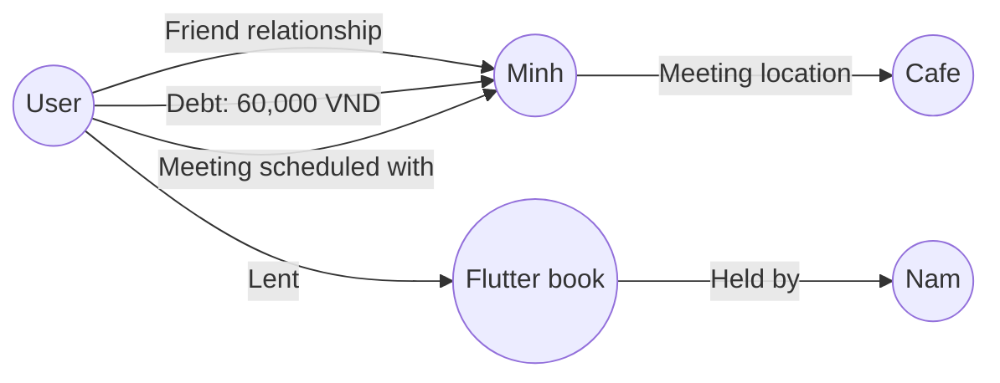

## 3.2. Database Design and Memory Storage Mechanism

### 3.2.1. Mem0 data storage structure
The **VocalMind** system uses a non-traditional storage mechanism. Instead of a complex relational database (RDBMS) with dozens of tables linked by foreign keys, it uses the power of a **Vector Database** combined with a **Knowledge Graph** managed through the Mem0 library.

Each user's memory storage in Mem0 consists of two parallel storage components:

#### 3.2.1.1. Vector Store
Each user memory is broken down into short knowledge assertions (for example: *"The user's name is Nam"*, *"Nam has a cat named Mun"*, *"Nam owes Minh 60,000 VND on 15/06/2026"*). Each assertion is converted into a semantic embedding vector and stored in the Vector Database along with metadata such as:
*   `id`: Unique memory identifier (UUID).
*   `user_id`: Identifier of the user who owns the memory (for example: `default-user`).
*   `text`: Raw original memory text.
*   `created_at`: Memory creation time.
*   `updated_at`: Most recent memory update time.

#### 3.2.1.2. Knowledge graph store
Alongside the Vector Store, Mem0 builds a network graph of entities and relationships (Nodes and Edges).
*   **Nodes:** Represent people (User, Minh, Nam), locations (Office, Cafe), objects (Flutter book, Money), and events (Meetings, Debts).
*   **Edges:** Represent connections between entities with attribute labels (for example: `USER --[OWES_MONEY (amount: 60k)]--> MINH`).

Below is an illustration of the personal memory graph structure in VocalMind:

---

### 3.2.2. Automatic memory classification, extraction, and linking

Memory management is fully automatic and runs in the background through two main mechanisms: **semantic retrieval** and **continuous memory add/update**.

#### 3.2.2.1. Semantic retrieval
When the user says, *"Where did I meet Minh the other day?"*, the system performs semantic search on the Vector Store:
1.  The query is converted into a query vector.
2.  Cosine distance search is performed on the vector database to find the 5 nearest memory vectors related to the entities "meeting", "Minh", and "location."
3.  The result returns a list of related assertions:
    *   *- "The user has a meeting scheduled with Minh."*
    *   *- "The user met Minh at Trung Nguyen Cafe near the office."*
4.  These memories are merged into a memory context to be sent into the LLM prompt.

#### 3.2.2.2. Continuous memory and conflict resolution
When the user says, *"Minh just paid me 40k,"* the system calls `memory.add()`. Mem0 performs the following tasks using its internal semantic LLM analysis:
1.  **Extract new information:** Entity `Minh` paid `40,000 VND` to `User`.
2.  **Compare with old memory:** Mem0 searches for memories related to Minh's debts and finds: *"User owes Minh 60,000 VND"* or *"Minh owes User 60,000 VND"*.
3.  **Update or remove old memory:**
    *   If Minh owes the User: the system recalculates the remaining debt (`60k - 40k = 20k`) and automatically updates the old memory to *"Minh owes User 20,000 VND"*.
    *   If the old information completely conflicts with the new one (for example, it previously said *"Minh is in IT class 1"* and later says *"Minh is in Information Security class"*), the system updates the class attribute of the Minh entity accordingly.
4.  This mechanism eliminates data noise and conflicts in the database and keeps the second brain accurate and up to date.
